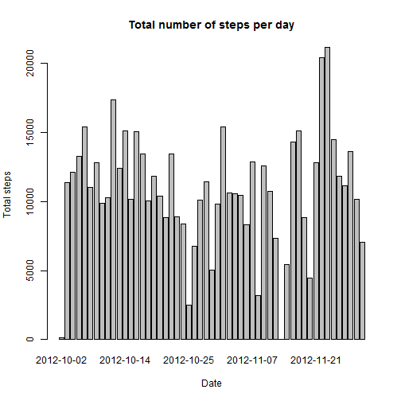
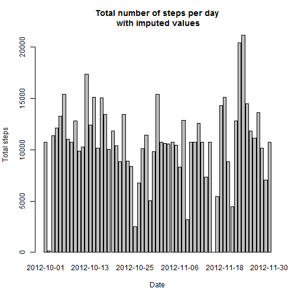

# Reproducible Research: Peer Assessment 1


## Loading and preprocessing the data


```r
#unzip (if necessary)
if (!file.exists("activity.csv")) {
    unzip("activity.zip")
}

#load the data
activity <- read.csv("activity.csv")

#convert date variable to date type
activity$date <- as.Date(activity$date)
```
Data is provided in form of .csv file and consists of 3 variables

1. number of steps
2. date of measurement
3. 5 minute interval of measurement

Missing values in `step` variable are coded as NA values.

Sample of data:

```r
activity[sample(nrow(activity), 6), ]
```

```
##       steps       date interval
## 13901     0 2012-11-18      620
## 14886     0 2012-11-21     1625
## 16573     0 2012-11-27     1300
## 14891     0 2012-11-21     1650
## 1716      0 2012-10-06     2255
## 1074     40 2012-10-04     1725
```

## What is mean total number of steps taken per day?


```r
#calculate total steps taken per day
steps_per_day <- aggregate(formula = steps~date, data = activity, FUN = sum,
                           na.rm=TRUE)


barplot(steps_per_day$steps, names.arg = steps_per_day$date, 
        main="Total number of steps per day", xlab = "Date", ylab = "Total steps")
```

 


```r
mean_steps_per_day <- mean(steps_per_day$steps)
median_steps_per_day <- median(steps_per_day$steps)
```

Mean of steps taken per day:   1.0766 &times; 10<sup>4</sup>.  
Median of steps taken per day: 10765.

## What is the average daily activity pattern?


```r
#calculate average steps per interval
avg_steps_per_interval <-  aggregate(formula=steps~interval, data=activity,
                                     FUN=mean, na.rm=TRUE)

plot(avg_steps_per_interval, type = "l")
```

 


```r
max_interval <- avg_steps_per_interval[which.max(avg_steps_per_interval$steps),]
```

Interval 835 has most steps taken on average.

## Imputing missing values

Total number of missing values in the dataset (i.e. the total number of rows with NAs)


```r
#count all rows with missing values
sum(!complete.cases(activity))
```

```
## [1] 2304
```

Intervals with missing values will be filled with average values for that interval


```r
#merge activity data with average steps per interval from previous step
activity_imputed <- merge(activity, avg_steps_per_interval, by="interval"
                         , suffixes=c("", "_avg"))

#replace missing values for steps with averages
activity_imputed$steps <- ifelse(is.na(activity_imputed$steps), activity_imputed$steps_avg,
                                 activity_imputed$steps)

#remove no longer needed column
activity_imputed$steps_avg <- NULL
```


```r
#calculate total steps taken per day (without missing values)
steps_per_day_imputed <- aggregate(formula = steps~date, data = activity_imputed,
                                   FUN = sum, na.rm=TRUE)


barplot(steps_per_day_imputed$steps, names.arg = steps_per_day_imputed$date, 
        main="Total number of steps per day\n with imputed values", xlab = "Date",
        ylab = "Total steps")
```

 


```r
mean_steps_per_day_imputed <- mean(steps_per_day_imputed$steps)
median_steps_per_day_imputed <- median(steps_per_day_imputed$steps)
```

Mean of steps taken per day (without missing values):   1.0766 &times; 10<sup>4</sup>.  
Median of steps taken per day (without missing values): 1.0766 &times; 10<sup>4</sup>.

Imputing missing values with interval averages had almost no effect on
mean and median steps taken per day.

## Are there differences in activity patterns between weekdays and weekends?


```r
#set locale for weekday function
Sys.setlocale("LC_TIME", "English")
```


```r
#calculate if it is weekday or weekend
activity_imputed$datetype <- ifelse(weekdays(as.Date(activity_imputed$date))
                                              %in% c("Saturday", "Sunday"),
                                              "weekend", "weekday")

#convert to factor
activity_imputed$datetype <- as.factor(activity_imputed$datetype)

#calculate means for every interval and datetype combination
steps_per_daytype_interval <- aggregate(steps ~ interval + datetype, data = activity_imputed, mean)
```


```r
#load or install lattice package
if(!suppressMessages(require(lattice))){
    print('trying to install lattice')
    install.packages('lattice')
    if(suppressMessagesrequire(lattice)){
        print("lattice installed and loaded")
    } else {
        stop("could not install lattice")
    }
}
```


```r
xyplot(steps ~ interval | datetype, steps_per_daytype_interval, type = "l", layout = c(1, 2), 
       xlab = "Interval", ylab = "Number of steps")
```

 
